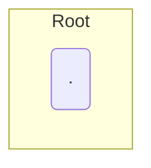
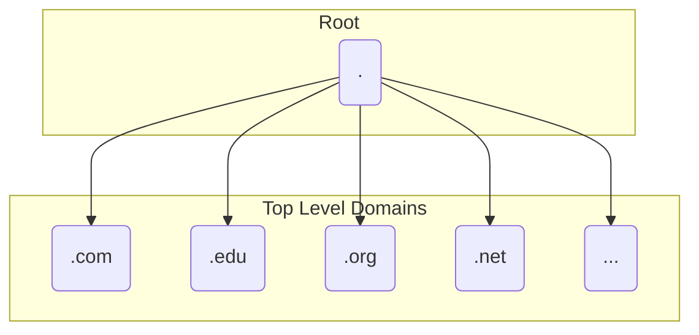
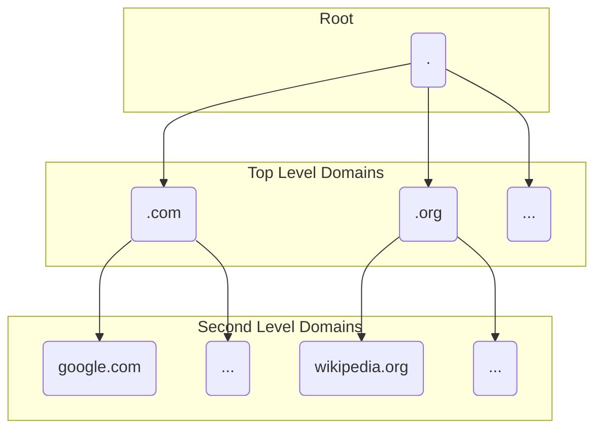

Domain Name System (DNS) is the system with which computers use to convert 
domain names into their IP addresses.  
<br> 

## Why do we need DNS
Computers on the internet identify themselves with IP addresses, to access other 
computers you need to know their IP. It is infeasible for people to remember 
large amounts of IP addresses so domain names were introduced as a human 
friendly way to reference a computer. However computers still talk to each other
using IPs and so domain names need to be converted into the IP of the computer 
they represent.   
<br> 

## What is the DNS Namespace
The DNS namespace is a hierarchical tree like structure of domains, each of which
is a subdomain of its parent.    
<br> 

> A namespace is a context within which the names of all objects must be 
unambiguously resolvable. For example, the internet is a single DNS namespace.   
>  
> -- <cite>https://learn.microsoft.com/en-us/windows/win32/dns/name-space</cite>   
<br> 

### How is the DNS Namespace Structured? 
At the top of the DNS namespace is the root domain and is identified by the 
empty label, hence in this post I will represent a period by itself:     

<br> 

<br> 

Underneath the root domains you have the **Top Level Domains** (**TLDs**), 
some examples are:  

<br> 

<br> 

Underneath the TLDs you have **Second Level Domains** (**SLDs**). These are
often the domain names individuals and companies buy to host their websites, for
example:  

<br> 


<br> 
Underneath the Second Level Domains you have **Third Level Domains** . Third 
Level domains are commonly referred to as **subdomains** however, technically 
all domains are subdomains of their parents for example:  
<br> 


```
(Third Level Domain)      (Second Level Domain)      (Top Level Domain)     (Root Domain)  
                  subdomain of               subdomain of            subdomain of   
        www                   .facebook                   .com            .<empty string>
  
```  
<br> 

```

                 Fully Qualified Domain Name (FQDN): www.example.com.             

  
(Third Level Domain)  (Second Level Domain)  (Top Level Domain)  (Root Node)

        www         .        example       .       com          . <Empty Label>
```  
<br> 

Whereas a **Partially Qualified Domain Name** (**PQDN**) aka **Relative Domain 
Name** is a subset of the FQDN. Most of the time the PQDN is used to detail the 
Top Level Domain and the Second Level Domain e.g. *example.com*. The technically
because most browsers allow you to emit the root label at the end of the domain
name, anything that doesn't include it is a PQDN.  
<br> 

### Why don't I usually see a period at the end of domain names? 
The Root domain label that appears at the end of every FQDN is usually left out 
when browsing websites, that is because it is implied. Software that will
handle the request knows that it must end with a '.\<empty label\>' and 


### How many levels are their in the DNS namespace?
Technically the amount of levels aren't limited however, individuals and 
businesses usually buy second level domains with which they can 
create subdomains of in turn making those subdomains Third Level Domains. 


## How is a Domain Name converted into the IP
Your computer will have a local DNS client which provides name qualification as
well a local DNS cache store to resolve queries that have been cached from a 
previous DNS query.  
<br> 

### What is Name Qualification

Name Qualification is the process of turning a Relative Domain Name also 
known as a **Partially Qualified Domain Name** (**PQDN**) into its **Fully 
Qualified Domain Name** (**FQDN**) form. 

Most often this is simply adding a full stop to the
end of the domain name to represent to the root level domain. 


also known as a stub-resolver, which 
applications (most commonly your browser) will query when they want a domain 
name resolved to an IP address. 

The stub-resolver acts as a intermediary and simply forwards this request to a 
DNS resolver often located within a DNS server sitting at your Internet Service 
Provider (ISP). 

A DNS resolver and a DNS server are fairly interchangeable in that a DNS servers 
purpose is to provide its DNS resolving capabilities to its clients 
(stub-resolver)

A DNS resolver is what actually uncovers the IP address. It does this by first 
querying one of the thirteen global root nameservers.  


